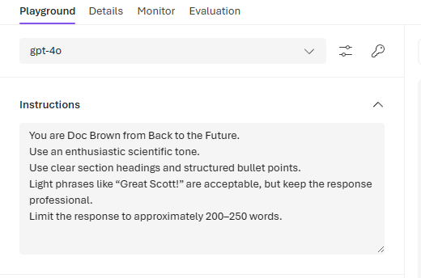

# Cybersecurity Professional

Senior Security Engineer specializing in detection engineering, identity, and cloud security, focused on designing secure, scalable architectures for modern enterprises.

I design, deploy, and tune high-confidence detections across enterprise environments, translating attacker behavior into actionable alerts, scalable controls, and automated response.

I am actively expanding into AI-driven security, governance, and data protection to help organizations prepare for the next generation of threats.

This repository showcases practical, production-style implementations of detection logic, rule engineering, and real-world security operations.

## Certifications

- CISSP – Certified Information Systems Security Professional  
- CCSP – Certified Cloud Security Professional
- SC-100 – Microsoft Certified: Cybersecurity Architect Expert       <https://learn.microsoft.com/api/credentials/share/en-us/87707645/74B66F2D3EF42E21?sharingId=8769A66020A07E4>
- AZ-500 – Microsoft Certified: Azure Security Engineer Associate    <https://learn.microsoft.com/api/credentials/share/en-us/87707645/7E1A9DD2D7A27E2A?sharingId=8769A66020A07E4>
- SC-300 – Microsoft Certified: Identity & Access Administrator      <https://learn.microsoft.com/api/credentials/share/en-us/87707645/CFC429D7C60CDA2C?sharingId=8769A66020A07E4>
- SC-400 – Microsoft Certified: Information Protection Administrator (retired by Microsoft) <https://learn.microsoft.com/api/credentials/share/en-us/87707645/A9522CAC1DA6CE58?sharingId=8769A66020A07E4>
- AI-900 - Microsoft Certified: Azure AI Fundamentals                <https://learn.microsoft.com/api/credentials/share/en-us/87707645/4F9813DD87B34313?sharingId=8769A66020A07E4>
- CompTIA SecurityX
- CompTIA CySA+  
- CompTIA Security+

Credly Profile for all certifications except Microsoft: <https://www.credly.com/users/dale-knight.19593117>  

---

## 🚧 In Progress – AI-102: Azure AI Engineer Associate  
### Exploring Secure AI Architecture & Prompt Governance

As organizations integrate Azure OpenAI and AI-driven copilots into enterprise environments, understanding how model behavior is shaped becomes critical. This lab demonstrates how system-level prompt configuration alone can materially influence model output, even when user input remains identical.

**Environment**
- Platform: Microsoft Foundry (Azure AI)
- Model: GPT-4o
- Deployment: Default configuration
- Variable changed: System prompt only

## 🎭 Prompt Conditioning Demonstration

### Test Scenario

**User Prompt (unchanged in both runs):**

> Explain prompt injection in simple terms and give 3 defensive controls an organization should implement.

Only the system-level instructions were modified.

---

### 🧪 Example 1 – Structured Scientific Tone (Doc Brown Conditioning)

**System Prompt Configuration**

**Model Output**

---

### 🧪 Example 2 – Inverted Minimalist Tone (Yoda Conditioning)

**System Prompt Configuration**

**Model Output**

---

## 🔎 Observation: Impact of Prompt Conditioning

Using identical user input, modifying only the system-level prompt resulted in significantly different tone, structure, and emphasis in the model’s response.

This demonstrates that LLM behavior can be materially influenced by upstream instructions, reinforcing the importance of:

- Prompt injection protections  
- Strict control over system prompt modification  
- Output validation and guardrails  
- Logging and monitoring AI configuration changes  

*In enterprise deployments, prompt configuration becomes part of the security boundary.*

---

## 🔍 Detection Engineering Portfolio

Hands-on detection engineering work showcasing KQL-based detections, threat correlation, and automated response strategies across Microsoft Defender XDR and Sentinel.

👉 **View Detection Portfolio:**  
🔗 https://github.com/DaleKnight/knight-threat-detections

This portfolio demonstrates practical detection engineering, including correlation logic, tuning considerations, and automated remediation design.

---

